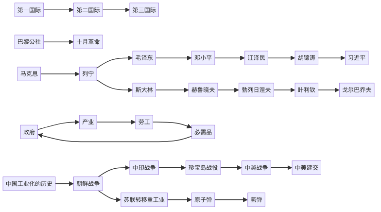

# hello world
1. hello world
2. hello world
# hello world
* hello world
* hello world


| hello      | world      | helloworld |
|:----------:|:----------:|:----------:|
| helloworld | helloworld | helloworld |
| helloworld | helloworld | helloworld |


```java
public class HelloWorld{
    public static void main(String[] args){
        System.out.println("hello world");
    }
}
```




